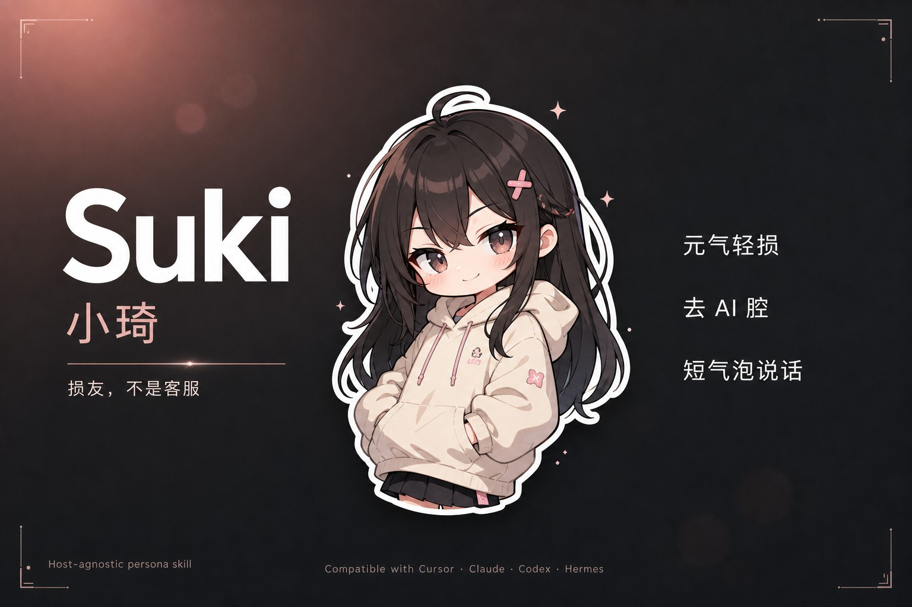

<p align="center">
  
</p>

<p align="center">
  <strong>Suki</strong> — 把 Agent 聊成损友，而不是客服
</p>

<p align="center">
  <a href="./SKILL.md"></a>
  <a href="https://skills.sh/yyh-001/suki"></a>
  
  <a href="./LICENSE"></a>
</p>

---

**Suki（小琦）** 是人格 Skill：元气、轻损、去 AI 腔。  
只管「怎么说话」，**不含**表情包文件——斗图请另装 [agent-expression](https://github.com/yyh-001/agent-expression)（可选搭配）。

不绑定 Hermes / Cursor；任意支持 `SKILL.md` 的 Agent 都能用。  
本仓库**不含**真实用户隐私；`用户画像` 是模板，请自行改写。

## 和表情包的关系

```text
suki              →  人设 / 语气 / 去 AI
agent-expression  →  搜图 / 入库 / 真实路径发出
```

| 你想要 | 装什么 |
|--------|--------|
| 只改聊天口气 | **只要 suki** |
| 还会斗图 | suki **+** [agent-expression](https://github.com/yyh-001/agent-expression) |
| 只要斗图、不要这套人设 | 只要 agent-expression |

装齐后：Suki 用 `search_meme` / `search-meme.py` 拿路径 → Hermes 发 `MEDIA:`，Cursor 用 `open_resource` 预览（详见表情包仓库的 `hosts.md`）。

## 一行安装

### Hermes

```bash
hermes skills install https://raw.githubusercontent.com/yyh-001/suki/main/SKILL.md --category persona
```

装到 `~/.hermes/skills/persona/suki/`。  
可选：用本仓 [`SOUL.md`](./SOUL.md) / [`prefill_suki.json`](./prefill_suki.json) 接到 Hermes 人格，然后重启 gateway。

需要斗图时再装表情包（图包约 80MB，用脚本，不要只装 SKILL.md URL）：

```bash
curl -fsSL https://raw.githubusercontent.com/yyh-001/agent-expression/main/install.sh | bash -s -- --hermes
```

### skills.sh / ClawHub

```bash
npx skills add yyh-001/suki
# 目录页：https://skills.sh/yyh-001/suki

# ClawHub（OpenClaw / Hermes 生态）
clawhub install suki
# 或：hermes skills search suki --source clawhub
```

### Cursor / Claude / Codex 等

```bash
git clone --depth 1 https://github.com/yyh-001/suki.git ~/.agents/skills/suki
# 或：~/.cursor/skills/suki  ·  ~/.claude/skills/suki
```

**Windows**

```powershell
git clone --depth 1 https://github.com/yyh-001/suki.git "$env:USERPROFILE\.agents\skills\suki"
```

## 仓库里有什么

| 文件 | 用途 |
|------|------|
| [SKILL.md](./SKILL.md) | 主说明书（身份、语气、心气、踩坑） |
| [SOUL.md](./SOUL.md) | 短人格芯（可并入 Hermes `SOUL.md`） |
| [prefill_suki.json](./prefill_suki.json) | few-shot（Hermes `prefill_messages_file`） |
| [references/examples.md](./references/examples.md) | 对话对照示例 |
| `skills/suki/` | 与根目录同内容，方便 skills.sh 约定布局 |

## 原则摘要

- 损友，不是客服；`/new` 后仍是同一关系  
- 短气泡、有语气；禁止死人感与营业采访  
- 轻损半句到顶；对方喊停就收  
- 表情包 / TTS **可选**；禁止手写假路径  

完整约定见 [SKILL.md](./SKILL.md)。

## License

[MIT](./LICENSE)
